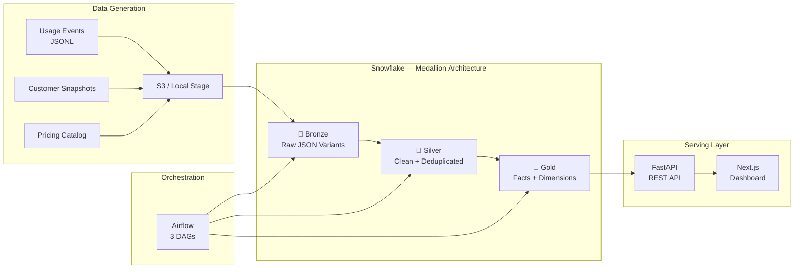
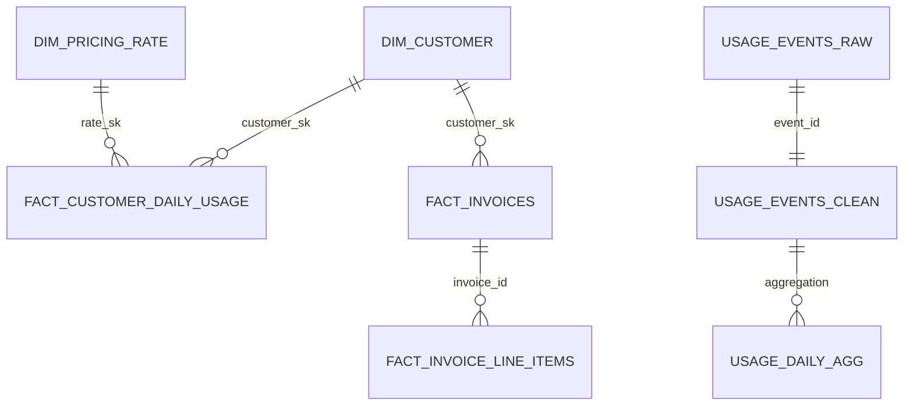

<div align="center">

# ☁️ NimbusBill

### Warehouse-Native Usage-Based Billing Platform

[](https://python.org)
[](https://snowflake.com)
[](https://airflow.apache.org)
[](https://fastapi.tiangolo.com)
[](https://nextjs.org)

*Ingest raw usage telemetry → Apply metered pricing → Generate auditable invoices*

</div>

---

## Architecture

NimbusBill treats the **Data Warehouse as the billing engine**. Raw usage events flow through a Medallion Architecture (Bronze → Silver → Gold), where pricing is applied, invoices are generated, and late-arriving events trigger automatic reconciliation.



### Airflow DAGs

| DAG | Schedule | Purpose |
|-----|----------|---------|
| `daily_usage_billing_pipeline` | `0 2 * * *` | Ingest → Dedupe → Aggregate → Compute Costs → DQ Checks |
| `month_end_invoice_close` | `0 4 1 * *` | Freeze period → Generate invoices + line items → Integrity check |
| `late_arrival_reconciliation` | `0 6 * * *` | Detect late events → Create adjustment line items → Update totals |

### Data Model



---

## Project Structure

```
NimbusBill/
├── airflow/               # Airflow Docker setup + DAGs
│   ├── dags/              # 3 DAGs (daily, monthly, reconciliation)
│   ├── Dockerfile         # Custom image with Snowflake provider
│   ├── docker-compose.yaml
│   └── .env               # Airflow connections (gitignored)
├── api/                   # FastAPI REST API
│   ├── main.py            # All endpoints (connected to Snowflake)
│   └── .env.example       # Template for credentials
├── datagen/               # Synthetic data generators
│   ├── generate_usage_events.py
│   ├── generate_customers.py
│   ├── generate_pricing.py
│   └── upload_to_s3.py
├── docs/                  # Architecture, schema, & billing docs
├── scripts/               # Init & seed scripts
│   ├── init_snowflake.py  # Bootstrap DB + schemas
│   ├── load_seed_data.py  # Load reference data
│   └── launch.bat         # One-command startup (Windows)
├── seeds/                 # Static reference data (CSV)
├── sql/                   # All Snowflake DDL + logic (00-07)
│   └── dq/                # Data quality checks
├── tests/                 # pytest test suite
├── web/                   # Next.js billing dashboard
└── .gitignore
```

---

## Quick Start

### Prerequisites
- Python 3.8+ with `pip`
- Docker Desktop
- Node.js 18+
- Snowflake account ([free trial](https://signup.snowflake.com/))

### 1. Clone & Setup
```bash
git clone https://github.com/your-username/NimbusBill.git
cd NimbusBill
pip install -r api/requirements.txt
```

### 2. Initialize Snowflake
```bash
# Edit credentials in scripts/init_snowflake.py, then:
python scripts/init_snowflake.py
```

### 3. Generate Sample Data
```bash
python datagen/generate_usage_events.py --output datagen/data
python datagen/generate_customers.py --output datagen/data
python datagen/generate_pricing.py --output datagen/data
```

### 4. Load Reference Data
```bash
python scripts/load_seed_data.py
```

### 5. Start Airflow
```bash
cd airflow
docker-compose up -d --build
# UI: http://localhost:8081 (admin/admin)
```

### 6. Start API
```bash
cd api
uvicorn main:app --reload --port 8000
# Swagger docs: http://localhost:8000/docs
```

### 7. Start Dashboard
```bash
cd web
npm install && npm run dev
# Dashboard: http://localhost:3000
```

### 8. Trigger Pipeline
In Airflow UI → Enable `daily_usage_billing_pipeline` → Click **Trigger DAG**.

---

## Key Engineering Decisions

| Decision | Rationale |
|----------|-----------|
| **Medallion Architecture** | Clean separation of raw ingestion (Bronze), deduplication/validation (Silver), and business logic (Gold) |
| **MERGE-based deduplication** | Guarantees idempotent ingestion — safe to re-run without creating duplicates |
| **SCD Type 2 dimensions** | Tracks historical changes to customers and pricing rates with `EFFECTIVE_START`/`EFFECTIVE_END` |
| **Division-by-zero assertions** | Snowflake doesn't support `RAISE`/`ERROR()` in all contexts; `1/IFF(condition, 0, 1)` fails the task on violation |
| **Late arrival reconciliation** | Automatically detects events that arrive after invoice issuance and creates adjustment line items |
| **Warehouse-native billing** | Pricing applied inside Snowflake via SQL joins, not in application code — single source of truth |

---

## Testing

```bash
pip install pytest httpx
python -m pytest tests/ -v
```

---

## API Endpoints

| Method | Path | Description |
|--------|------|-------------|
| `GET` | `/health` | Health check + Snowflake connectivity |
| `GET` | `/dashboard/summary` | KPI cards (revenue, customers, invoices) |
| `GET` | `/customers` | List all active customers |
| `GET` | `/customers/{id}/usage` | Daily usage breakdown |
| `GET` | `/invoices` | List invoices (filterable) |
| `GET` | `/invoices/{id}` | Invoice detail with line items |
| `GET` | `/usage` | Flexible usage query |
| `GET` | `/pricing` | Current pricing rates |
| `GET` | `/pipeline/status` | Latest Airflow run statuses |

Full interactive docs available at `/docs` when the API is running.

---

## Documentation

- [Architecture](docs/architecture.md) — Medallion layers, DAG descriptions
- [Schema Reference](docs/schema.md) — All table definitions
- [Data Contracts](docs/data_contracts.md) — JSON schemas & field specs
- [Billing Close & Reconciliation](docs/billing_close_and_recon.md) — Month-end and late arrival logic
- [Demo Script](docs/demo_script.md) — Step-by-step walkthrough

---

## Tech Stack

| Layer | Technology |
|-------|------------|
| Data Warehouse | Snowflake |
| Orchestration | Apache Airflow 2.7 |
| API | FastAPI + Pydantic |
| Frontend | Next.js 13 + Tailwind CSS |
| Data Generation | Python (Faker patterns) |
| Containerization | Docker Compose |
| Testing | pytest + FastAPI TestClient |

---

<div align="center">
<sub>Built by Sathvik · Data Engineering Portfolio Project</sub>
</div>
