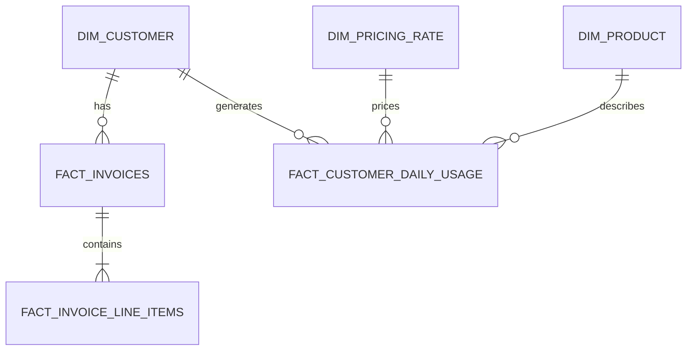

# NimbusBill Database Schema

## ER Diagram (Conceptual)

## Table Definitions

### BRONZE (Raw)
- `USAGE_EVENTS_RAW`: Partitioned by `DT`. Full JSON in `RAW` variant.

### SILVER (Clean)
- `USAGE_EVENTS_CLEAN`: Primary Key `EVENT_ID`. Deduplicated.
- `USAGE_DAILY_AGG`: Aggregated by `DATE, CUSTOMER, PRODUCT`. Source for billing.

### GOLD (Business)
- `DIM_CUSTOMER`: SCD Type 2. Validation key for billing.
- `FACT_INVOICES`: The legal bill. Columns: `SUBTOTAL`, `TAX`, `TOTAL`.
- `FACT_INVOICE_LINE_ITEMS`:
  - `LINE_TYPE`: 'usage', 'base_fee', 'adjustment'.
  - `AMOUNT`: The financial impact.
